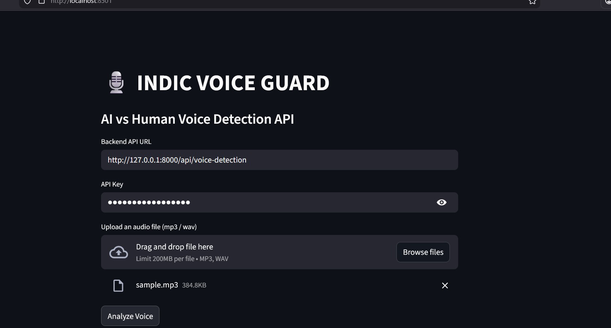
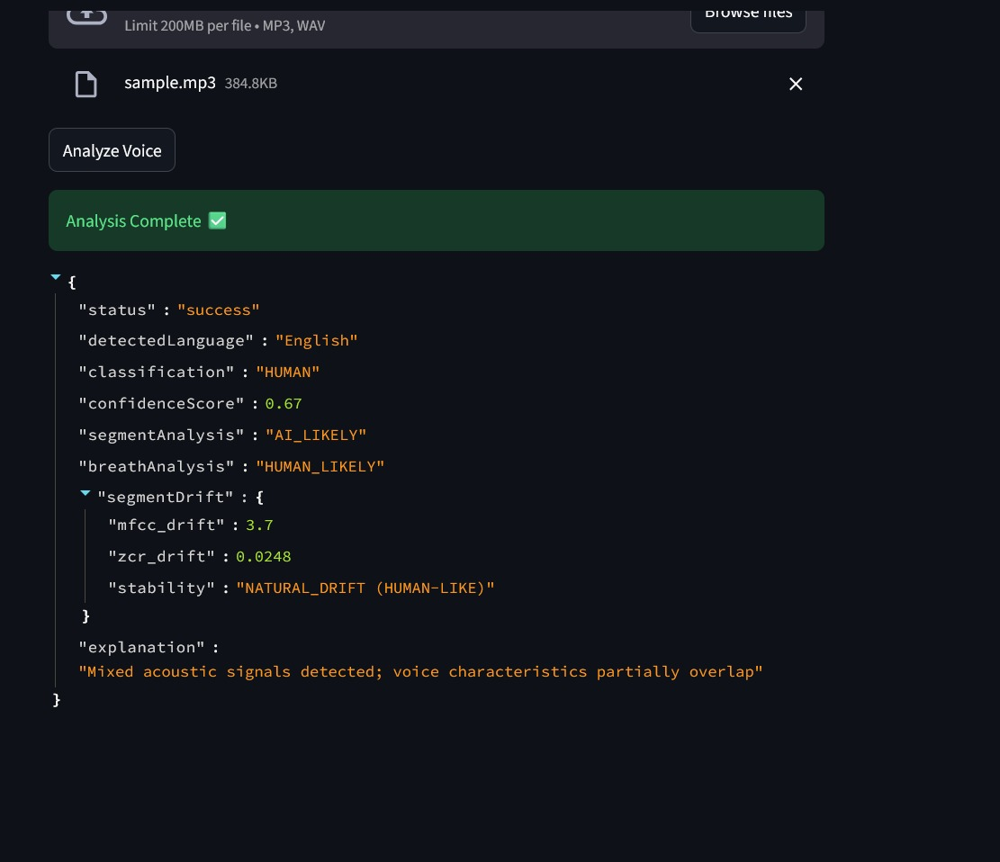

# INDIC VOICE GUARD

An explainable, API-first system to distinguish AI-generated voices from human speech across multiple languages.

---

## Overview

INDIC VOICE GUARD is an API-based system that analyzes an audio sample and determines whether the voice is **Human** or **AI-generated**.

It also automatically detects the spoken language from the audio.

The solution is designed to work across multiple Indian and global languages and focuses on audio signal behavior, not heavy machine-learning training.

---
## 🚀 Project Demo





## Problem Being Solved

AI-generated voices are becoming extremely realistic and are now used for:

- Voice impersonation
- Fake phone calls
- Audio deepfakes
- Misinformation

### Most Existing Tools Are:

- Black-box ML models
- Language-specific
- Not explainable

### This Project Solves That By Providing:

- A clear API
- Explainable outputs
- Multi-language support

Language detection is done automatically from audio using Whisper.

---

## Language Support

Currently supported:
- English
- Tamil
- Hindi
- Malayalam
- Telugu

---

## How the System Works

The system analyzes acoustic characteristics of speech that behave differently in humans and AI voices.

### 1. Language Detection

- Uses Whisper to detect the spoken language
- Independent of classification logic

### 2. Core Audio Feature Extraction

From the audio signal:
- **MFCC** (speech texture)
- **Pitch variation**
- **Zero Crossing Rate**
- **Spectral flatness**

These features are known to behave more uniformly in AI speech.

### 3. Segment Consistency Check

- Audio is split into multiple time segments
- AI voices tend to remain very consistent
- Human voices naturally change over time

### 4. Breath & Silence Detection

- Measures silence ratio and non-silent segments
- Human speech contains natural pauses and breathing
- AI speech is often too smooth

### 5. Segment Drift Analysis

- Measures how much features drift across segments
- Natural drift → Human-like
- Very low drift → AI-like

---

## API Details

### Endpoint
```
POST /api/voice-detection
```

### Header
```
x-api-key: sk_test_123456789
```

### Request Body
```json
{
  "audioFormat": "mp3",
  "audioBase64": "<base64_encoded_audio>"
}
```

### Sample Response
```json
{
  "status": "success",
  "detectedLanguage": "English",
  "classification": "HUMAN",
  "confidenceScore": 0.67,
  "segmentAnalysis": "AI_LIKELY",
  "breathAnalysis": "HUMAN_LIKELY",
  "segmentDrift": {
    "mfcc_drift": 1.35,
    "zcr_drift": 0.0348,
    "stability": "NATURAL_DRIFT (HUMAN-LIKE)"
  },
  "explanation": "Mixed acoustic signals detected; voice characteristics partially overlap"
}
```

### Output Explanation

- **detectedLanguage** → Language spoken in the audio
- **classification** → Final result (Human / AI)
- **confidenceScore** → Heuristic confidence (not ML probability)
- **segmentAnalysis** → Consistency across audio segments
- **breathAnalysis** → Natural breathing & silence behavior
- **segmentDrift** → Measures natural variation
- **explanation** → Human-readable reasoning

---

## Tech Stack

- **FastAPI** – REST API
- **Librosa** – Audio signal processing
- **Whisper** – Language detection
- **NumPy** – Feature computation
- **Uvicorn** – Server
- **Streamlit** – Frontend interface

---

## Installation & Setup

### 1. Install Dependencies
```bash
pip install -r requirements.txt
```

### 2. Start the Backend API
```bash
python -m uvicorn main:app --reload
```

### 3. Start the Frontend (Streamlit)
```bash
python -m streamlit run frontend.py
```

### 4. Open Swagger UI (Backend Documentation)
```
http://127.0.0.1:8000/docs
```

### 5. Access the Frontend
```
http://localhost:8501
```

---

## Use Cases

- Voice deepfake detection
- Call center fraud prevention
- Audio verification pipelines
- Media authenticity checks
- Forensic audio analysis

---

## Why This Is Relevant

- Fully API-based, as required
- Works across multiple languages
- Does not rely on fake ML claims
- Outputs are explainable
- Easy to extend with new checks

---

## Future Scope

- Audio tampering detection
- Cross-language robustness scoring
- Real-time streaming support

---

## Author

**Lakshana R**  
Computer Science Engineering Student  
Voice & Audio Forensics
